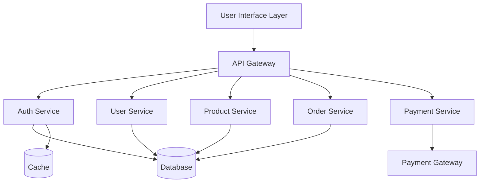

# System Decomposition & Planning

## Purpose
Break complex problems into well-defined components, modules, and agent-level responsibilities with clear boundaries.

## Used by
- project-orchestrator
- architecture-designer

## Overview
System decomposition is the architectural skill of breaking down a complex system into manageable, cohesive components with well-defined interfaces and minimal coupling. This skill enables parallel development, reduces complexity, and creates maintainable systems that can evolve over time.

## Core Principles

### 1. Separation of Concerns
- Each component has a single, well-defined responsibility
- Components don't overlap in functionality
- Changes to one component shouldn't require changes to others
- Clear boundaries between business logic, data access, and presentation

### 2. High Cohesion, Low Coupling
- **High Cohesion**: Related functionality grouped together
- **Low Coupling**: Minimal dependencies between components
- Components communicate through well-defined interfaces
- Implementation details are hidden (encapsulation)

### 3. Modularity
- Components can be developed, tested, and deployed independently
- Clear entry and exit points
- Composable and reusable modules
- Pluggable architecture for easy replacement

### 4. Scalability by Design
- Components can scale independently
- Stateless where possible
- Clear data ownership boundaries
- Designed for horizontal scaling

## Decomposition Strategies

### 1. Functional Decomposition
Break system by business capabilities or use cases.

**Example: E-commerce System**
```
├── User Management
│   ├── Authentication
│   ├── Authorization
│   ├── Profile Management
│   └── Account Settings
├── Product Catalog
│   ├── Product Search
│   ├── Product Details
│   ├── Inventory Management
│   └── Category Management
├── Shopping Cart
│   ├── Cart Management
│   ├── Cart Persistence
│   └── Cart Validation
├── Order Processing
│   ├── Order Creation
│   ├── Order Fulfillment
│   ├── Order Tracking
│   └── Order History
└── Payment Processing
    ├── Payment Gateway Integration
    ├── Payment Validation
    └── Refund Management
```

### 2. Layer Decomposition
Organize by technical layers.

```
┌─────────────────────────────────────┐
│     Presentation Layer              │
│  (UI Components, Pages, Routes)     │
├─────────────────────────────────────┤
│     Application Layer               │
│  (Business Logic, Workflows)        │
├─────────────────────────────────────┤
│     Domain Layer                    │
│  (Entities, Value Objects, Rules)   │
├─────────────────────────────────────┤
│     Infrastructure Layer            │
│  (Database, External APIs, Cache)   │
└─────────────────────────────────────┘
```

### 3. Domain-Driven Decomposition
Based on bounded contexts and domain models.

**Example: Healthcare System**
```
Bounded Contexts:
├── Patient Management Context
│   ├── Patient Registration
│   ├── Medical History
│   └── Patient Portal
├── Appointment Scheduling Context
│   ├── Appointment Booking
│   ├── Calendar Management
│   └── Reminders
├── Clinical Context
│   ├── Diagnosis
│   ├── Treatment Plans
│   └── Prescriptions
└── Billing Context
    ├── Invoice Generation
    ├── Insurance Claims
    └── Payment Processing
```

### 4. Data Flow Decomposition
Organize around data pipelines and transformations.

```
Input → Validation → Processing → Transformation → Storage → Output
  │         │            │              │             │         │
  └─────────┴────────────┴──────────────┴─────────────┴─────────┘
           Components handle specific data stages
```

## Planning Process

### Phase 1: System Understanding (15%)

#### 1. Gather Requirements
- Review specifications and user stories
- Identify functional and non-functional requirements
- Understand constraints (technical, business, regulatory)
- Map stakeholder expectations

#### 2. Identify Core Entities
```markdown
**Entity Identification Checklist:**
- [ ] What are the main business objects? (User, Product, Order)
- [ ] What actions are performed on these objects? (Create, Update, Delete)
- [ ] What relationships exist between entities?
- [ ] What are the data validation rules?
- [ ] What is the lifecycle of each entity?
```

#### 3. Map User Journeys
```
User Journey: Online Purchase
1. Browse products → Product Catalog Component
2. Add to cart → Shopping Cart Component
3. Checkout → Order Processing Component
4. Make payment → Payment Component
5. Receive confirmation → Notification Component
6. Track order → Order Tracking Component
```

### Phase 2: High-Level Decomposition (25%)

#### 1. Identify Major Subsystems
```markdown
## Subsystem Template

### Subsystem Name: User Authentication Service

**Purpose**: Authenticate and authorize users across the platform

**Responsibilities**:
- User registration and login
- JWT token generation and validation
- Password management (reset, change)
- Role-based access control (RBAC)
- Session management

**Boundaries**:
- IN SCOPE: Authentication, authorization, session management
- OUT OF SCOPE: User profile data (handled by User Management Service)

**Dependencies**:
- Database: PostgreSQL for user credentials
- Cache: Redis for session storage
- Email Service: For password reset emails

**Interfaces**:
- REST API: `/api/v1/auth/*`
- Internal SDK: `AuthService.authenticate(credentials)`

**Data Ownership**:
- Users table (credentials, roles)
- Sessions table (active sessions)
- Audit logs (login attempts, password changes)

**Non-Functional Requirements**:
- Performance: < 100ms authentication check
- Security: bcrypt password hashing, JWT with RS256
- Availability: 99.99% uptime (critical service)
- Scalability: Support 10,000 concurrent users
```

#### 2. Define Component Boundaries


#### 3. Establish Communication Patterns
```markdown
## Communication Patterns

### Synchronous (REST API)
- User Interface ↔ API Gateway
- API Gateway ↔ Services (when immediate response needed)
- Use for: User actions, queries, real-time operations

### Asynchronous (Message Queue)
- Order Service → Email Service (order confirmation)
- Payment Service → Order Service (payment completed)
- Use for: Long-running operations, background jobs, eventual consistency

### Event-Driven
- Product updated → Inventory Service subscribes
- Order placed → Multiple services react (inventory, shipping, email)
- Use for: Decoupled systems, multiple consumers, audit trails
```

### Phase 3: Detailed Component Design (40%)

#### 1. Component Specification Template
```markdown
# Component: Shopping Cart Service

## Overview
Manages user shopping carts with persistence, validation, and synchronization.

## Responsibilities
1. **Cart Operations**
   - Add/remove/update items in cart
   - Calculate cart totals with taxes and discounts
   - Validate item availability and pricing

2. **Cart Persistence**
   - Save cart state to database
   - Restore cart across sessions
   - Merge guest cart with user cart on login

3. **Cart Validation**
   - Check item availability in inventory
   - Validate pricing against product catalog
   - Apply promotion rules and discounts

## API Contract

### Add Item to Cart
```typescript
POST /api/v1/cart/items

Request:
{
  "productId": "string",      // UUID
  "quantity": number,          // Positive integer
  "options": {                 // Optional
    "size": "string",
    "color": "string"
  }
}

Response 200:
{
  "cart": {
    "id": "string",
    "items": [...],
    "subtotal": number,
    "tax": number,
    "total": number
  }
}

Response 400: Invalid product or quantity
Response 404: Product not found
Response 409: Product out of stock
```

### Get Cart
```typescript
GET /api/v1/cart

Response 200:
{
  "cart": {
    "id": "string",
    "userId": "string | null",  // null for guest carts
    "items": [
      {
        "id": "string",
        "productId": "string",
        "productName": "string",
        "quantity": number,
        "price": number,
        "subtotal": number,
        "options": {...}
      }
    ],
    "subtotal": number,
    "tax": number,
    "discount": number,
    "total": number,
    "updatedAt": "ISO 8601 timestamp"
  }
}
```

## Data Model

### Database Schema
```sql
CREATE TABLE carts (
  id UUID PRIMARY KEY DEFAULT gen_random_uuid(),
  user_id UUID REFERENCES users(id),
  session_id VARCHAR(255),  -- For guest carts
  created_at TIMESTAMP DEFAULT NOW(),
  updated_at TIMESTAMP DEFAULT NOW(),
  expires_at TIMESTAMP,     -- Auto-cleanup after 30 days
  CONSTRAINT user_or_session CHECK (
    (user_id IS NOT NULL AND session_id IS NULL) OR
    (user_id IS NULL AND session_id IS NOT NULL)
  )
);

CREATE TABLE cart_items (
  id UUID PRIMARY KEY DEFAULT gen_random_uuid(),
  cart_id UUID REFERENCES carts(id) ON DELETE CASCADE,
  product_id UUID REFERENCES products(id),
  quantity INTEGER CHECK (quantity > 0),
  price DECIMAL(10,2),      -- Price at time of adding
  options JSONB,             -- Product options (size, color, etc)
  created_at TIMESTAMP DEFAULT NOW(),
  updated_at TIMESTAMP DEFAULT NOW(),
  UNIQUE(cart_id, product_id, options)
);

CREATE INDEX idx_carts_user_id ON carts(user_id);
CREATE INDEX idx_carts_session_id ON carts(session_id);
CREATE INDEX idx_cart_items_cart_id ON cart_items(cart_id);
```

## Business Rules

### Rule 1: Cart Item Limits
- Maximum 100 items per cart
- Maximum 99 quantity per item
- If limit exceeded: Return 400 with error

### Rule 2: Price Validation
- Prices stored at time of adding to cart
- Validate against current price on checkout
- If price changed: Notify user, update cart

### Rule 3: Inventory Validation
- Check product availability on add/update
- Revalidate on checkout
- If unavailable: Remove item, notify user

### Rule 4: Cart Expiration
- Guest carts expire after 30 days
- User carts persist indefinitely
- Cleanup job runs daily to remove expired carts

## Dependencies

### Internal Services
- **Product Service**: Get product details, pricing, availability
- **Inventory Service**: Check stock levels
- **Pricing Service**: Calculate taxes, apply discounts
- **User Service**: Merge guest cart on login

### External Services
- None (self-contained)

### Infrastructure
- **Database**: PostgreSQL (primary storage)
- **Cache**: Redis (session carts for performance)
- **Message Queue**: RabbitMQ (cart events)

## Events Published

```typescript
// Cart events for other services to consume
CartItemAdded {
  cartId: string,
  userId: string | null,
  productId: string,
  quantity: number,
  timestamp: Date
}

CartItemRemoved {
  cartId: string,
  userId: string | null,
  productId: string,
  timestamp: Date
}

CartAbandoned {
  cartId: string,
  userId: string | null,
  items: [...],
  timestamp: Date
}
```

## Error Handling

| Error Scenario | HTTP Code | Error Code | Recovery |
|---------------|-----------|------------|----------|
| Product not found | 404 | PRODUCT_NOT_FOUND | Show error, suggest alternatives |
| Out of stock | 409 | OUT_OF_STOCK | Show error, remove from cart |
| Invalid quantity | 400 | INVALID_QUANTITY | Show error, keep previous quantity |
| Cart limit exceeded | 400 | CART_LIMIT_EXCEEDED | Show error, block add |
| Database error | 500 | INTERNAL_ERROR | Retry, fallback to cache |

## Performance Requirements

- **Response Time**: < 100ms for get operations, < 200ms for mutations
- **Throughput**: Support 1000 requests/sec
- **Cache Hit Rate**: > 80% for cart reads
- **Database Queries**: < 50ms at p95

## Security Considerations

- **Authorization**: Users can only access their own carts
- **Session Security**: Guest carts tied to secure session tokens
- **Input Validation**: Sanitize all inputs to prevent injection
- **Rate Limiting**: Max 100 requests/minute per user/session

## Testing Strategy

### Unit Tests
- Cart calculation logic (totals, taxes, discounts)
- Business rule enforcement (limits, validation)
- Data model validation

### Integration Tests
- API endpoint behavior (add, update, remove items)
- Database operations and transactions
- Service-to-service communication

### Performance Tests
- Load testing: 1000 concurrent users
- Stress testing: Peak traffic scenarios
- Cache effectiveness validation

## Monitoring and Observability

### Metrics
- Cart operations per second (add, update, remove)
- Average cart value
- Cart abandonment rate
- Cache hit/miss ratio
- API response times (p50, p95, p99)

### Logs
- All cart operations (INFO level)
- Validation failures (WARN level)
- Errors and exceptions (ERROR level)

### Alerts
- Response time > 500ms (WARNING)
- Error rate > 1% (CRITICAL)
- Cart abandonment > 70% (INFO)
- Database connection pool exhausted (CRITICAL)

## Deployment

### Container Configuration
```yaml
apiVersion: apps/v1
kind: Deployment
metadata:
  name: cart-service
spec:
  replicas: 3
  template:
    spec:
      containers:
      - name: cart-service
        image: cart-service:latest
        resources:
          requests:
            memory: "256Mi"
            cpu: "250m"
          limits:
            memory: "512Mi"
            cpu: "500m"
        env:
        - name: DATABASE_URL
          valueFrom:
            secretKeyRef:
              name: cart-service-secrets
              key: database-url
        - name: REDIS_URL
          valueFrom:
            secretKeyRef:
              name: cart-service-secrets
              key: redis-url
```

### Scaling Strategy
- Horizontal scaling: Auto-scale based on CPU (target 70%)
- Vertical scaling: Increase memory if cache size grows
- Database: Connection pooling, read replicas if needed

## Rollback Plan
1. Monitor error rates and performance after deployment
2. If error rate > 5%: Immediate rollback
3. Rollback process: Revert to previous Docker image
4. Database migrations: Use backward-compatible changes
5. Zero-downtime deployment: Blue-green deployment strategy
```

#### 2. Interface Design

```typescript
// Internal Service Interface
interface CartService {
  // Cart operations
  getCart(userId: string): Promise<Cart>;
  addItem(userId: string, item: CartItem): Promise<Cart>;
  updateItem(userId: string, itemId: string, quantity: number): Promise<Cart>;
  removeItem(userId: string, itemId: string): Promise<Cart>;
  clearCart(userId: string): Promise<void>;

  // Cart validation
  validateCart(cartId: string): Promise<ValidationResult>;
  recalculateTotals(cartId: string): Promise<Cart>;

  // Cart merge (guest to user)
  mergeGuestCart(guestCartId: string, userId: string): Promise<Cart>;
}

// Event Interface
interface CartEventPublisher {
  publishCartItemAdded(event: CartItemAddedEvent): Promise<void>;
  publishCartItemRemoved(event: CartItemRemovedEvent): Promise<void>;
  publishCartAbandoned(event: CartAbandonedEvent): Promise<void>;
}
```

#### 3. Dependency Mapping

```markdown
## Dependency Matrix

| Component | Depends On | Used By | Dependency Type |
|-----------|-----------|---------|-----------------|
| Cart Service | Product Service | Order Service | Synchronous API |
| Cart Service | Pricing Service | - | Synchronous API |
| Cart Service | Redis Cache | - | Infrastructure |
| Cart Service | PostgreSQL | - | Infrastructure |
| Order Service | Cart Service | API Gateway | Synchronous API |
| Email Service | Cart Service | - | Asynchronous Event |
```

### Phase 4: Integration Planning (20%)

#### 1. Define Integration Points

```markdown
## Integration: Cart Service ↔ Product Service

**Purpose**: Fetch product details and validate availability

**Protocol**: REST API over HTTPS

**Endpoints Used**:
- GET /api/v1/products/{id}
- POST /api/v1/products/batch (for cart validation)

**Error Handling**:
- Product not found: Remove from cart, notify user
- Service unavailable: Use cached data, show warning
- Timeout (3s): Retry once, then fail gracefully

**Circuit Breaker**:
- Open after 5 consecutive failures
- Half-open after 30 seconds
- Close after 3 successful requests

**Caching Strategy**:
- Cache product data for 5 minutes
- Invalidate on product update event
- Fallback to stale cache if service down
```

#### 2. Data Consistency Strategy

```markdown
## Consistency Model

### Strong Consistency
- Cart operations within single service
- Payment processing
- Order creation

### Eventual Consistency
- Cart abandonment notifications
- Analytics and reporting
- Email notifications

### Conflict Resolution
- Last-write-wins for cart updates
- Timestamp-based for concurrent modifications
- User-prompted resolution for price changes
```

## Best Practices

### DO:
✅ Start with high-level decomposition before details
✅ Define clear ownership boundaries (data, functionality)
✅ Design interfaces before implementations
✅ Consider failure modes and degradation strategies
✅ Document assumptions and constraints
✅ Use standard patterns (don't reinvent the wheel)
✅ Plan for evolution (how will this grow?)
✅ Consider operational aspects (monitoring, deployment)
✅ Validate decomposition with stakeholders
✅ Keep components independently deployable

### DON'T:
❌ Create too many small components (micro-microservices)
❌ Share databases between components
❌ Create circular dependencies
❌ Design for theoretical future requirements
❌ Ignore non-functional requirements
❌ Skip interface documentation
❌ Assume perfect network reliability
❌ Create god components that do everything
❌ Forget about data migration and versioning
❌ Ignore organizational boundaries (Conway's Law)

## Common Patterns

### 1. API Gateway Pattern
```
Client → API Gateway → [Auth, Cart, Order, Payment Services]
         ↓
    Rate Limiting, Auth, Logging, Caching
```

**Benefits**: Centralized concerns, simplified client
**Tradeoffs**: Single point of failure, added latency

### 2. Backend for Frontend (BFF)
```
Web App → Web BFF → Services
Mobile App → Mobile BFF → Services
```

**Benefits**: Optimized for each client, parallel development
**Tradeoffs**: Code duplication, more services to maintain

### 3. Event-Driven Architecture
```
Service A → Event Bus → [Service B, Service C, Service D]
            ↓
      Event Store (Audit Trail)
```

**Benefits**: Loose coupling, scalability, audit trail
**Tradeoffs**: Eventual consistency, complex debugging

### 4. CQRS (Command Query Responsibility Segregation)
```
Commands → Write Model → Database
Queries → Read Model → Optimized Views
```

**Benefits**: Optimized reads/writes, scalability
**Tradeoffs**: Complexity, eventual consistency

## Evaluation Checklist

### Component Quality
- [ ] Single, clear responsibility
- [ ] Well-defined interfaces
- [ ] Minimal dependencies
- [ ] Independent deployability
- [ ] Clear error handling
- [ ] Documented assumptions
- [ ] Testability considered

### System Quality
- [ ] No circular dependencies
- [ ] Balanced component sizes
- [ ] Clear data ownership
- [ ] Defined consistency boundaries
- [ ] Scalability planned
- [ ] Failure modes considered
- [ ] Monitoring strategy defined

### Documentation Quality
- [ ] Component purposes clear
- [ ] Interfaces documented
- [ ] Dependencies mapped
- [ ] Integration patterns specified
- [ ] Diagrams included
- [ ] Examples provided
- [ ] Tradeoffs explained

## Tools and Resources

### Diagramming Tools
- **C4 Model**: Context, Containers, Components, Code
- **Mermaid**: Diagrams as code
- **Draw.io**: Visual architecture diagrams
- **PlantUML**: UML diagrams as code

### Design Patterns
- **Microservices Patterns**: Chris Richardson
- **Domain-Driven Design**: Eric Evans
- **Enterprise Integration Patterns**: Gregor Hohpe

## Success Metrics

A good decomposition results in:
- Clear team ownership boundaries
- Parallel development without conflicts
- Independent deployment of components
- Easy to reason about system behavior
- Minimal coordination overhead
- Natural evolution and growth paths
- High cohesion within components
- Low coupling between components

## Related Skills
- **Specification Writing**: Understanding requirements for decomposition
- **Task Breakdown**: Converting components into implementable tasks
- **Code Generation**: Implementing designed components
- **Technical Documentation**: Documenting architecture decisions
